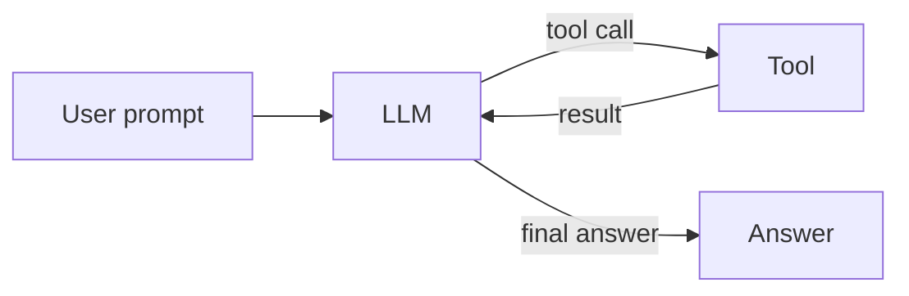

## What you'll build

A complete, runnable masterclass in building AI agents — starting from a single
LLM call and ending with a tested, deployed, multi-agent system. Every concept
is backed by real, runnable TypeScript under `src/agents/`, and **every code
sample on this site is imported directly from those source files** so the docs
can never drift from the code.

The diagram above is the **agent loop**: an LLM in a loop that can call tools,
inspect their results, and decide what to do next until it produces a final
answer.

## The curriculum

The course is organized into four parts:

- **Part I — Foundations**: what an agent is, your first agent loop, the anatomy
  of a tool.
- **Part II — Core Capabilities**: streaming & memory, structured output,
  the `ToolLoopAgent` class, and RAG.
- **Part III — Production Hardening**: robust error handling, human-in-the-loop
  approval, security, observability & cost, and testing/evaluating agents.
- **Part IV — Architecture & Scale**: multi-agent orchestration, a capstone
  walkthrough, building your own agent, and deploying to production.

## Who this is for

TypeScript developers who want to build real, production-grade AI agents — not
just call a chat API. You should be comfortable with `async`/`await`, ES modules,
and the basics of the terminal. See [Prerequisites](/guide/prerequisites) for the
full list, then head to [Getting Started](/guide/getting-started).

## A taste of the code

Here is a real shared tool from the repo (`src/tools.ts`), imported live into
this page:

<<< @/../src/tools.ts{ts}
