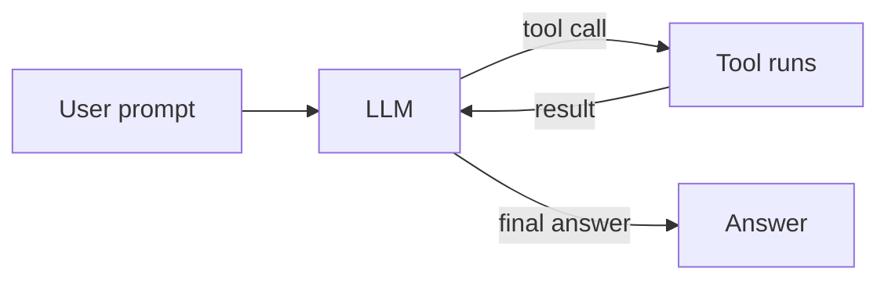

# Lesson 1 — What is an agent?

> **You'll build:** a clear mental model of what separates an "agent" from a plain
> LLM call — and you'll run a real one to see the difference.
> **Concepts:** the agent loop, autonomy spectrum, agent vs. workflow vs. single call  ·  **Run:** `yarn dev 1`

## The idea

A large language model (LLM), on its own, does exactly one thing: you give it
text, and it gives you text back. That's a **single call**. It cannot check the
weather, query a database, or do reliable arithmetic — it can only *predict* the
next words.

An **agent** is what you get when you put an LLM **in a loop** and give it
**tools** it can choose to call. Instead of guessing the weather, the model can
*decide* to call a `getWeather` tool, read the real result, and use it in its
answer. Crucially, the model — not your code — decides **which** tool to call,
**when**, and **what to do with the result**.

That single shift — from "predict text once" to "decide, act, observe, repeat" —
is the entire foundation of this course.

::: tip Refresher — what is a "token"?
LLMs read and write text in chunks called **tokens** (roughly ¾ of a word). When
we talk about cost and limits later, we count tokens, not characters. For now,
just know: more text in and out = more tokens = more cost.
:::

## Mental model

The defining feature of an agent is the **loop**. The model can respond with a
*tool call* instead of a final answer. Your runtime executes the tool, feeds the
result back, and asks the model what to do next — over and over — until the model
produces a final text answer (or hits a safety limit).



Read the diagram as a cycle: the arrow from **Tool runs** back to **LLM** is the
loop. Without that back-arrow, you don't have an agent — you have a single call
that happens to mention a tool.

## The autonomy spectrum

"Agent" is not binary; it's a spectrum of how much you let the model decide:

| Level | Who decides the steps? | Example |
| ----- | ---------------------- | ------- |
| **Single call** | You. One prompt, one answer. | "Summarize this paragraph." |
| **Workflow** | You, mostly. Fixed, hard-coded steps; the LLM fills in blanks. | "Extract fields → validate → format" pipeline you wrote. |
| **Agent** | The model. It chooses which tools to call and when, in a loop. | "Answer this support ticket, using whatever tools you need." |

Higher autonomy means more flexibility but less predictability. A big theme of
this course is **earning** that autonomy safely — with good tool design, error
handling, human approval gates, and observability.

## The problem

Imagine you skip the agent loop and just ask a plain LLM:

> "What's the weather in Paris right now, and what is 23 × 19?"

A single LLM call will **hallucinate** a weather report (it has no live data) and
may get the multiplication wrong (LLMs are notoriously shaky at arithmetic). It
has no way to *act* — only to *guess*.

The fix is to give the model tools and let it loop: call `getWeather("Paris")`,
call `calculator("23 * 19")`, then combine both real results into one answer.

## Walkthrough

Here is a real, runnable agent from the repo. The single highlighted block is the
agent loop — notice `stopWhen: stepCountIs(10)`, which is what permits the model
to take multiple steps (tool calls **and** a final answer) in one request.

<<< @/../src/agents/01-oneshot.ts#loop{ts}

The `stopWhen: stepCountIs(10)` line is the hinge of the whole lesson. Without
it, the SDK would stop after the model's first tool call and never come back to
produce a final answer. With it, the model may loop up to 10 steps.

You can see the full file — including how we print each step of the loop — here:

<<< @/../src/agents/01-oneshot.ts{ts}

## Run it

```bash
yarn dev 1
```

You'll see the agent **narrate its own loop** before answering — each tool it
called, the arguments it chose, and the result that came back:

```
🔎 Agent steps (the loop in action):

  Step 1: 🛠  called `getWeather`
            input: {"city":"Paris"}
            result: {"city":"Paris","condition":"...","temperatureC":...}
  Step 2: 🛠  called `calculator`
            input: {"expression":"23 * 19"}
            result: {"expression":"23 * 19","result":437}

💬 Final answer:
  <a short paragraph combining the real weather + 437>
```

The exact weather values are mock data (Lesson 3 explains why), but the important
thing to observe is the **loop**: the model decided to call two tools, read their
results, and only then wrote its answer.

## Production caveats

::: warning The loop can run away
`stepCountIs(10)` is a **safety limit**, not a suggestion. Every step is another
LLM call that costs tokens and time. A misbehaving agent can loop until it hits
the cap. Always set a sane limit, and later (Lesson 11) we'll measure exactly
what each step costs.
:::

::: warning Tools are trust boundaries
The moment your agent can *act*, it can act *wrongly*. A model that can call
`getWeather` is harmless; a model that can call `sendEmail` or `deleteUser` is
not. Parts III and IV are largely about controlling this power.
:::

## Exercises

1. **Break the loop on purpose.** Open `src/agents/01-oneshot.ts` and remove the
   `stopWhen: stepCountIs(10)` line, then run `yarn dev 1`. What changes in the
   output, and why?

   ::: details Solution
   Without `stopWhen`, the SDK stops after the first tool call. You'll see the
   tool get called but **no final answer** that incorporates both results — the
   loop never continues past step 1. This is the single most common "my agent
   doesn't finish" bug.
   :::

2. **Change the task.** Edit the default `task` string to ask only a weather
   question (no math). How many steps does the agent take now?

   ::: details Solution
   It typically takes a single tool-call step (`getWeather`) followed by the
   final answer. The model only calls the tools it actually needs — it isn't
   forced to use all of them.
   :::

3. **Classify three things you've built.** For three programs you've written,
   label each as *single call*, *workflow*, or *agent* using the table above.
   There's no code to write — the goal is to internalize the spectrum.

## Key takeaways

- An **LLM call** predicts text once; an **agent** is an LLM **in a loop** that
  can call **tools** and decide its own next step.
- The loop is enabled by one line: `stopWhen: stepCountIs(N)`. Without it, the
  agent stops after the first tool call.
- "Agent" is a **spectrum** of autonomy: single call → workflow → agent.
- More autonomy = more capability **and** more risk. The rest of the course is
  about wielding that power safely.
