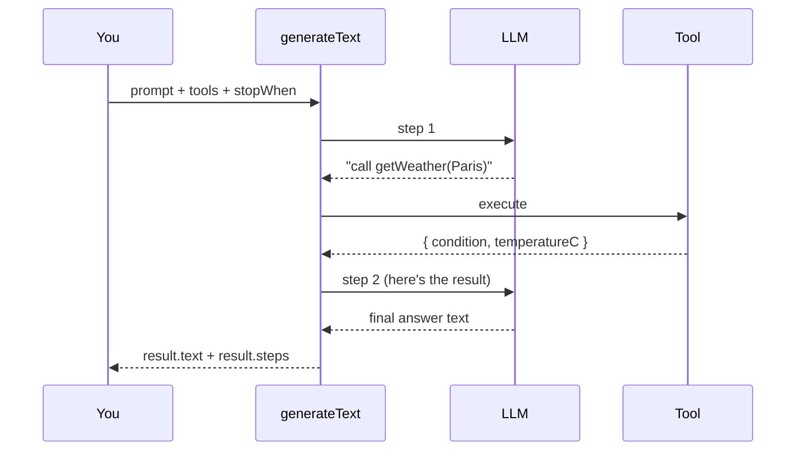

# Lesson 2 — Your first agent loop

> **You'll build:** a working agent with `generateText` + `stepCountIs`, and learn
> to read `result.steps` to *see* the loop happen.
> **Concepts:** `generateText`, `stopWhen`/`stepCountIs`, system prompts, inspecting steps  ·  **Run:** `yarn dev 1`

## The idea

In Lesson 1 you learned *what* an agent is. Now you'll learn the exact API that
turns a normal LLM call into one. In the Vercel AI SDK, the workhorse function is
`generateText`. By itself it does one round-trip. Add one option —
`stopWhen: stepCountIs(N)` — and it becomes a **loop** that can call tools and
keep going until it has a final answer.

This lesson uses the **same file** as Lesson 1 (`src/agents/01-oneshot.ts`), but
now we focus on the *mechanics* of each option rather than the big-picture idea.

## Mental model

`generateText` runs the loop for you. Each pass through the loop is a **step**.
A step is either a *tool call* (the model asked to run a tool) or the *final
answer* (the model is done).



The SDK is the orchestrator in the middle: it relays tool calls to your code and
results back to the model, counting steps against your `stopWhen` limit.

## The problem

If you call `generateText` with tools but **without** `stopWhen`, the loop never
runs to completion:

```ts
// ❌ Stops after the FIRST tool call — no final answer
const result = await generateText({
  model: openai("gpt-4o-mini"),
  prompt: "Weather in Paris and 23 * 19?",
  tools,
});
```

The model asks to call a tool, the SDK runs it… and then stops, because nothing
told it the loop may continue. You get a tool result but no synthesized answer.
This is the #1 beginner gotcha.

## Walkthrough

Here is the complete first agent. Each numbered comment maps to one option you
pass to `generateText`:

<<< @/../src/agents/01-oneshot.ts{ts}

Walking through the key options:

- **`model: openai("gpt-4o-mini")`** — picks the model. The `openai()` helper
  reads your `OPENAI_API_KEY` from the environment, so no key is hard-coded.
- **`system: "..."`** — the *system prompt*. It shapes persona and rules. Here we
  tell the model to **always use the tools** for weather and math instead of
  guessing. Pass this via the `system` option — never as a fake `messages` entry
  (that invites prompt-injection problems; more in Lesson 10).
- **`prompt: task`** — the actual user request.
- **`tools`** — the set of tools the model *may* call (defined in `src/tools.ts`,
  covered in Lesson 3).
- **`stopWhen: stepCountIs(10)`** — the line that makes it a loop. Up to 10 steps.

### Reading the loop with `result.steps`

The most useful learning tool here is `result.steps`. After the loop finishes,
it contains one entry per step, each with the `toolCalls` the model made and the
`toolResults` that came back:

```ts
result.steps.forEach((step, i) => {
  for (const call of step.toolCalls) {
    console.log(`Step ${i + 1}: called ${call.toolName}`, call.input);
  }
  for (const toolResult of step.toolResults) {
    console.log("   result:", toolResult.output);
  }
});
```

This is how you *debug* an agent: you can see exactly what it decided to do and
with what arguments — invaluable when behavior surprises you.

## Run it

```bash
yarn dev 1
```

Expected shape of the output (values vary, weather is mock):

```
🤖 TUTORIAL 1 — One-shot agent

📋 Task: What's the weather in Paris right now, and what is 23 * 19? ...

🔎 Agent steps (the loop in action):

  Step 1: 🛠  called `getWeather`
            input: {"city":"Paris"}
            result: {"city":"Paris","condition":"sunny","temperatureC":...}
  Step 2: 🛠  called `calculator`
            input: {"expression":"23 * 19"}
            result: {"expression":"23 * 19","result":437}

💬 Final answer:
  <one short paragraph using the real weather + 437>

📊 Tokens — input: ..., output: ...
```

Notice the final `📊 Tokens` line — every step consumed tokens. Hold that thought
for Lesson 11 (observability & cost).

## Production caveats

::: warning Pick `stepCountIs(N)` deliberately
`N` is your circuit breaker. Too low and complex tasks get cut off mid-loop; too
high and a confused agent can rack up cost. Start small (5–10) and raise it only
when a real task needs more.
:::

::: tip System prompt = behavior contract
Most "the agent won't use my tool" issues are really *prompt* issues. Be explicit
in `system`: tell the model when to use each tool and that guessing is not
allowed. The model reads both your system prompt **and** each tool's
`description` (Lesson 3) to decide.
:::

## Exercises

1. **Watch the step count change.** Add a third sub-question to the `task` (e.g.,
   "…and the weather in Tokyo too"). Re-run and count the steps in
   `result.steps`. Did the agent add a step?

   ::: details Solution
   Yes — asking about a second city usually adds another `getWeather` step, so
   you'll see three tool-call steps before the final answer. The model calls the
   tool once per city because each call needs different input.
   :::

2. **Tighten the limit.** Set `stopWhen: stepCountIs(1)` and run the default
   task. What happens to the final answer?

   ::: details Solution
   With only one step allowed, the agent can make a tool call but cannot loop back
   to synthesize a complete answer — you'll get a truncated or missing final
   answer. It proves that the *limit* directly bounds how much the agent can do.
   :::

3. **Strengthen the system prompt.** Rewrite the `system` string to forbid
   guessing even more firmly, then ask a math question the model might "know".
   Does it still call the calculator?

   ::: details Solution
   A firm system prompt ("you MUST use the calculator for any arithmetic, never
   compute in your head") makes the model reliably route math through the tool.
   This is how you make tool usage dependable rather than occasional.
   :::

## Key takeaways

- `generateText` is the core call; `stopWhen: stepCountIs(N)` turns it into an
  **agent loop**.
- Each pass is a **step**; `result.steps` exposes every `toolCall` and
  `toolResult` so you can see and debug the loop.
- The **system prompt** is your behavior contract — use it to make tool usage
  reliable.
- The step limit is a **safety bound**: choose it deliberately.
