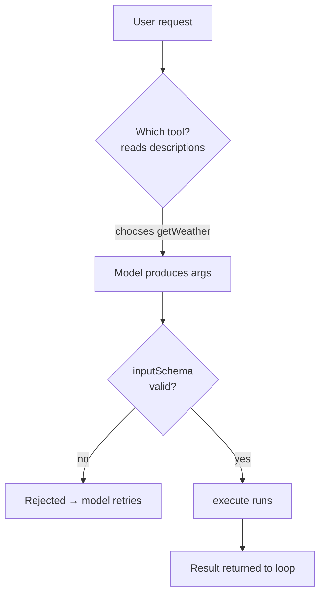

# Lesson 3 — Anatomy of a tool

> **You'll build:** a precise understanding of the three parts of a tool —
> `description`, `inputSchema`, `execute` — and how the model decides to call one.
> **Concepts:** `tool()`, Zod input schemas, tool descriptions, safe `execute`  ·  **Run:** `yarn dev 1`

## The idea

A **tool** is a function you hand to the model so it can *do* things, not just
talk. In the Vercel AI SDK you define one with the `tool()` helper, and every
tool has exactly three parts:

| Part | Who reads it | Why it matters |
| ---- | ------------ | -------------- |
| `description` | The **model** | It decides *when* to call the tool based on this text. |
| `inputSchema` | The model **and** the SDK | Tells the model what arguments to produce; the SDK validates them. |
| `execute` | Your **runtime** | The actual code that runs and returns a result to the loop. |

Get these three right and the model uses your tool reliably and safely. Get them
wrong — a vague description, a loose schema, an unsafe `execute` — and you get an
agent that calls the wrong tool, with bad arguments, doing dangerous things.

::: tip Refresher — what is a schema?
A **schema** is a machine-readable description of a data shape ("an object with a
string field called `city`"). We use **Zod** to write schemas in TypeScript. The
SDK turns your Zod schema into instructions for the model *and* validates the
model's output against it before your `execute` runs.
:::

## Mental model

When the agent loop runs, the model weighs each tool's `description` against the
user's request, then emits a tool call whose arguments must satisfy the
`inputSchema`. Only after validation passes does your `execute` run.



Notice the validation gate: the SDK protects your `execute` from malformed input.
Your job is to make the schema tight enough that "valid" also means "safe".

## The problem

Consider a tempting but **dangerous** calculator:

```ts
// ❌ NEVER do this — executes arbitrary model output as code
execute: async ({ expression }) => ({ result: eval(expression) }),
```

The model controls `expression`. With `eval`, a prompt-injection attack (or just
a confused model) could run arbitrary JavaScript on your server —
`process.exit()`, file access, anything. **Never run model output as code.** The
fix is to accept only a tiny, well-defined grammar and parse it yourself.

## Walkthrough

### A data-fetching tool

The weather tool shows the simplest shape: a clear description, a one-field
schema, and an `execute` that returns structured data.

<<< @/../src/tools.ts#weather-tool{ts}

Things to notice:

- The **description** explicitly says *when* to use it ("whenever the user asks
  about weather"). That sentence is what the model reads to make its decision.
- The **schema** uses `.describe(...)` on the `city` field. That hint is passed to
  the model so it knows exactly what to put there.
- The **execute** returns a structured object (`{ city, condition, temperatureC,
  unit }`). Structured results are easier for the model to use than prose. (It's
  mock data so the lesson runs without a weather API key.)

### A *safe* action tool

The calculator demonstrates the security mindset: it does real work on model
input without ever trusting that input blindly.

<<< @/../src/tools.ts#calculator-tool{ts}

The `execute` delegates to `safeEvaluate`, a small recursive-descent parser that
accepts **only** digits, decimals, whitespace, `+ - * /`, and parentheses —
nothing else. Anything outside that grammar is rejected before any math happens:

<<< @/../src/tools.ts#safe-evaluate{ts}


This is the whole point: the tool is powerful (it computes arbitrary arithmetic)
but **bounded** (it cannot execute code). Because `safeEvaluate` is a plain,
exported function, it's also directly unit-testable — which is exactly what we do
in the testing lessons.

### Bundling the tools

Finally, the tools are bundled into one object whose **keys are the names the
model uses**:

<<< @/../src/tools.ts#tools-bundle{ts}


When you saw `called \`getWeather\`` in Lessons 1–2, that name came from this
object's keys.

## Run it

The same first agent exercises both tools:

```bash
yarn dev 1
```

In `result.steps` you'll see the model choose `getWeather` for the weather part
of the question and `calculator` for the math part — proof that the
**descriptions** successfully routed each sub-task to the right tool.

## Production caveats

::: warning Treat every tool input as hostile
The model's tool arguments can be influenced by the user (and by injected text in
retrieved documents — Lesson 7 & 10). Validate with a **tight** schema and never
pass tool input to `eval`, shell commands, raw SQL, or file paths without
sanitizing. The calculator's allow-list grammar is a model for this.
:::

::: tip Descriptions are prompt engineering
If the model calls the wrong tool or skips a tool, improve the **description**
first. Say what the tool does, when to use it, and (sometimes) when *not* to.
Clear, specific descriptions beat clever code here.
:::

## Exercises

1. **Tighten a schema.** Add a constraint to the weather tool's `city` field so
   empty strings are rejected (hint: `z.string().min(1)`). What happens if the
   model sends an empty city?

   ::: details Solution
   With `.min(1)`, the SDK rejects an empty-string `city` during validation —
   `execute` never runs with bad input. The model receives the validation error
   and can retry with a real city. This is the schema acting as a safety gate.
   :::

2. **Break the calculator safely.** Call `safeEvaluate("2 + 2; process.exit()")`
   in a scratch test. What does it do, and why is that good?

   ::: details Solution
   It throws `"Expression contains invalid characters."` because `;`, letters,
   and `()` used as a call are outside the allowed grammar. The malicious payload
   is rejected *before* any evaluation — demonstrating why an allow-list beats
   `eval`.
   :::

3. **Add a third tool (design only).** Sketch the `description` and `inputSchema`
   for a `convertCurrency` tool. What fields does it need, and how would you keep
   `execute` safe?

   ::: details Solution
   You'd want fields like `amount: z.number().positive()`, `from: z.string()`,
   `to: z.string()`. Keep `execute` safe by validating currency codes against a
   known allow-list and using a trusted rate source — never interpolating the
   inputs into a query string or shell command.
   :::

## Key takeaways

- A tool has three parts: **`description`** (model decides when to call),
  **`inputSchema`** (model fills it, SDK validates), and **`execute`** (your safe
  runtime code).
- The **description** is prompt engineering — it drives tool selection.
- The **schema** is a validation gate — make it tight so "valid" implies "safe".
- **Never** run model output as code. Use bounded grammars/allow-lists like
  `safeEvaluate` instead of `eval`.
