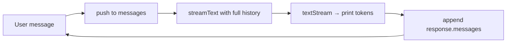

# Lesson 4 — Streaming & conversation memory

> **You'll build:** a terminal chat agent that streams its reply token-by-token
> and *remembers* the whole conversation across turns.
> **Concepts:** `streamText`, `textStream`, `ModelMessage[]` history, the `system` option  ·  **Run:** `yarn dev 2`

## The idea

A real chat agent needs two things our one-shot agent (Lessons 1–2) lacked:

1. **Streaming** — print the answer as it's generated instead of waiting for the
   whole thing. The difference between a frozen cursor and a typewriter.
2. **Memory** — remember what was said earlier so "and what about Paris?" makes
   sense. Without memory, every message is a brand-new conversation.

Both are small additions on top of the same agent loop you already know.

::: tip Refresher — tokens
Models generate text in **tokens** (word fragments), one after another.
Streaming exposes those tokens as they're produced, so you can render the reply
incrementally rather than blocking until the final token.
:::

## Mental model

Memory is just an array you keep growing. Each turn you append the user's
message, send the **entire** array, then append everything the model produced
back onto it — so the next turn sees the full history.



The array is the agent's whole memory. Drop it, and the agent forgets everything.

## The problem

A naive chat loop sends only the latest line:

```ts
// ❌ No memory — every turn is a blank slate
const result = streamText({ model, prompt: userInput });
```

Ask "What's the weather in Lisbon?" then "How about Madrid?" and the second
question fails — the model never saw the first. The fix is to keep a running
`messages` history and pass it every turn.

## Walkthrough

### The history array

We declare one `ModelMessage[]` and reuse it for the whole session. This single
array *is* the conversation memory.

<<< @/../src/agents/02-interactive.ts#memory-init{ts}

### One turn of the loop

Each turn does four things: append the user message, stream a response with the
**full** history, print tokens as they arrive, then append the model's output
back into history.

<<< @/../src/agents/02-interactive.ts#turn{ts}

Things to notice:

- We pass `messages` (the whole array), **not** `prompt` — that's what gives the
  agent memory.
- `result.textStream` is an async iterable of token chunks; the `for await` loop
  prints each one the instant it arrives.
- After streaming, `await result.response` gives us `messages` containing
  everything the model produced this turn (including any tool calls/results). We
  push those back so the next turn has complete context.
- `stopWhen: stepCountIs(10)` keeps the tool-calling loop alive, exactly like
  Lessons 1–2 — streaming and memory don't change the loop.

::: tip Set instructions via `system`, not a message
The persona is passed through the `system` option rather than as a
`{ role: "system" }` entry in `messages`. The SDK recommends this and warns about
prompt-injection risk when system text is mixed into the message array.
:::

## Run it

```bash
yarn dev 2
```

You'll get an interactive prompt. Try a two-turn exchange that depends on memory:

```
🧑 You: What's the weather in Lisbon?
🤖 Bot: It's sunny and 22°C in Lisbon.

🧑 You: How about Madrid?
🤖 Bot: Madrid is cloudy and 18°C.
```

The second answer only works because the first turn is still in `messages`. Type
`exit` (or `quit`) to leave.

## Production caveats

::: warning Context windows aren't infinite
Every turn re-sends the **entire** history, and you pay tokens for all of it. Long
conversations eventually overflow the model's context window. Real apps trim or
**summarize** old turns, or store history in a database and re-load a window of it.
:::

::: tip Piped stdin and EOF
`readline`'s `question()` rejects when stdin reaches EOF (e.g. piped input ends).
The lesson wraps it in `try/catch` and treats EOF as "quit" so piped input doesn't
crash with `ERR_USE_AFTER_CLOSE`.
:::

## Exercises

1. **Prove memory matters.** Comment out the final `messages.push(...newMessages)`
   line and re-run. Ask a follow-up question. What happens, and why?

   ::: details Solution
   The agent forgets each turn — follow-ups like "how about Madrid?" fail because
   the assistant's previous answer was never stored. Only the user messages
   accumulate, so the model has no prior context to build on.
   :::

2. **Inspect the history.** After the loop, `console.log(messages.length)` and log
   the `role` of each entry. How many entries does one tool-using turn add?

   ::: details Solution
   A single turn can add several entries: the user message, an assistant message
   with tool calls, tool result messages, and a final assistant text message.
   That's why `response.messages` is an array, not a single message.
   :::

3. **Switch to non-streaming.** Replace `streamText` with `generateText` and print
   `result.text`. What do you gain and lose?

   ::: details Solution
   You lose the token-by-token feel (the reply appears all at once) but the memory
   logic is identical — you still append `response.messages`. Streaming is purely a
   UX improvement; the loop and memory are unchanged.
   :::

## Key takeaways

- **Streaming**: `streamText` + `for await (const chunk of result.textStream)`
  renders tokens as they're generated.
- **Memory**: keep one `ModelMessage[]`; pass the whole array every turn and
  append `(await result.response).messages` after each turn.
- Pass the persona via the **`system`** option, not a message entry.
- History grows unbounded — trim or summarize for long-running chats.
