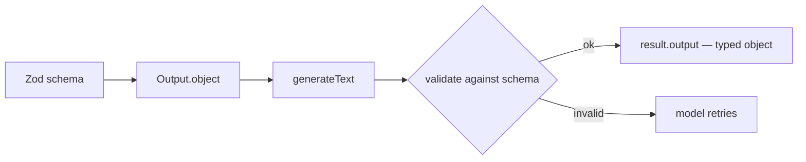

# Lesson 5 — Structured output

> **You'll build:** an agent that returns typed, validated JSON — not fragile
> free-form text — using the current `Output` API.
> **Concepts:** `Output.object`, Zod schemas, `generateObject` deprecation, tools + JSON  ·  **Run:** `yarn dev 3`

## The idea

So far our agents returned **text**. But often you want data your *code* can use:
an object with typed fields, not a paragraph you have to parse with regex. The
SDK can force the model's output to match a **Zod schema** and hand you back a
fully-typed, already-validated object.

::: warning `generateObject` / `streamObject` are deprecated
In AI SDK v6 the old structured-output functions are deprecated. The current
approach is to use the **same** `generateText` / `streamText` you already know and
pass an `output` setting built with the `Output` helper. One consistent API for
text, tools, *and* JSON.
:::

## Mental model

You describe the shape with Zod; the SDK turns it into constraints for the model
and validates the result before returning it on `result.output`.



The schema is both the **prompt** (it tells the model what to produce) and the
**contract** (the SDK won't hand you anything that doesn't match).

## The problem

Without a schema you're stuck string-parsing:

```ts
// ❌ Fragile — the model might phrase it a hundred ways
const { text } = await generateText({ model, prompt: "Extract the date…" });
const date = text.match(/\d{4}-\d{2}-\d{2}/)?.[0]; // 🤞 hope it's ISO
```

One reword from the model and your regex breaks. With `Output.object` the shape
is guaranteed.

## Walkthrough

### Extraction → typed JSON

Describe the shape with `z.object({...})`, pass it via `Output.object({ schema })`,
and read the validated result from `output`. The `.describe()` hints guide the
model toward the right values.

<<< @/../src/agents/03-json.ts#extraction{ts}

Things to notice:

- `output` is typed as your schema — `output.confirmedAttendees` is `string[]`
  with full autocomplete, no casting.
- `.describe(...)` on a field is a hint to the model, not just documentation.
- Validation happens before you get the object: if the model's output doesn't
  fit, the SDK makes it retry rather than handing you garbage.

::: tip Constrain choices with `z.enum`
For classification, `z.enum(["bug", "billing", …])` forces the model to pick from
a fixed set — no surprise categories. The lesson's DEMO 2 classifies a support
ticket exactly this way.
:::

### Tools + structured final answer (the full combo)

The real power: an agent can **call tools in a loop** (Lessons 1–4) *and* return
its final answer as typed JSON — all in one `generateText` call.

<<< @/../src/agents/03-json.ts#tools-plus-json{ts}

The agent is free to call `getWeather` for Oslo and Cairo along the way, but its
**final** answer is forced to match the schema (`warmerCity` can only be `"Oslo"`
or `"Cairo"`). This is structured output and the agent loop working together.

## Run it

```bash
yarn dev 3
```

The file runs four demos: extraction, enum classification, **streaming** a JSON
object (watch fields fill in via `partialOutputStream`), and the tools-plus-JSON
combo above. You'll see each printed as clean, typed JSON.

## Production caveats

::: warning A schema is a contract, not magic
The model can still produce *semantically* wrong values that are *structurally*
valid (e.g. the wrong date in the right format). Validate critical values yourself
and keep schemas tight (`.min()`, `.enum()`, `.positive()`) to shrink the space of
plausible mistakes.
:::

::: tip Streaming structured output
`streamText` + an `output` setting exposes `result.partialOutputStream` — the
object as it builds, fields appearing one by one — and `result.output` resolves to
the final validated object. Great for progressively rendering a form or card.
:::

## Exercises

1. **Add a field.** Give the extraction schema an `isVirtual: z.boolean()` field
   with a `.describe()`. Re-run and see how the model infers it.

   ::: details Solution
   Add `isVirtual: z.boolean().describe("True if the event is online/remote")`.
   The model reads the description and infers `false` for the rooftop party. The
   returned object is typed to include the new boolean automatically.
   :::

2. **Tighten with refinements.** Change `servings` in the recipe schema to
   `z.number().int().positive()`. What does the SDK do if the model returns `0`?

   ::: details Solution
   Validation fails and the SDK prompts the model to retry until it produces a
   positive integer. The constraint becomes part of the contract — you never
   receive `0` or a fractional serving.
   :::

3. **Force a bad enum.** Change `warmerCity` to `z.enum(["Oslo", "Cairo"])` then
   ask about two *different* cities. What happens?

   ::: details Solution
   The model is constrained to the two enum options even though they don't match
   the question — illustrating that a schema is a hard constraint. The fix is to
   keep the schema and the prompt consistent (or widen the enum).
   :::

## Key takeaways

- Use **`generateText`/`streamText` + `Output.object({ schema })`** — not the
  deprecated `generateObject`/`streamObject`.
- The Zod schema is both the instruction to the model and the validation contract;
  read the typed result from **`result.output`**.
- `z.enum`, `.min()`, `.positive()`, and `.describe()` make outputs precise.
- Tools and structured output combine: an agent can loop through tool calls and
  still return a typed JSON final answer.
- Streaming JSON is available via `partialOutputStream` + `result.output`.
