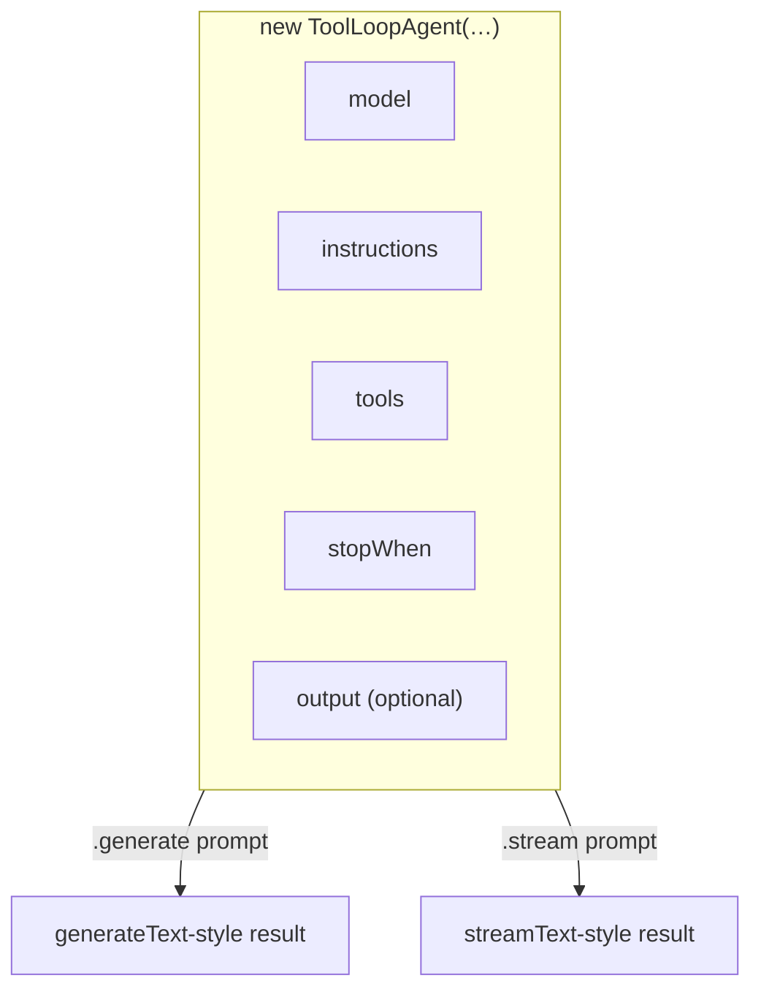

# Lesson 6 — The reusable `ToolLoopAgent`

> **You'll build:** a named, reusable agent you configure once and call anywhere —
> no more re-wiring `model + tools + system + stopWhen` on every request.
> **Concepts:** `ToolLoopAgent`, `.generate()` / `.stream()`, `instructions`, baked-in `output`  ·  **Run:** `yarn dev 4`

## The idea

In Lessons 1–5 we passed `model`, `tools`, `system`, and `stopWhen` **by hand** on
every `generateText` / `streamText` call. Fine for a one-off, tedious for a real
app. The SDK ships the `ToolLoopAgent` class: configure everything **once** in the
constructor, then call `.generate(...)` or `.stream(...)` as often as you like.

Think of it as *packaging* a configured agent into an object you can pass around.

## Mental model

The agent bundles five things; callers just supply a prompt.



`.generate()` returns the same shape as `generateText` (`.text`, `.steps`,
`.output`, `.usage`); `.stream()` matches `streamText`.

::: warning It's `instructions`, not `system`
The `ToolLoopAgent` constructor names the system prompt field **`instructions`**.
Passing `system` here won't set the persona. (`ToolLoopAgent` is also exported as
`Experimental_Agent`; `Agent` is the interface it implements.)
:::

## The problem

Re-wiring the same config everywhere invites drift:

```ts
// ❌ Repeated on every call — easy to let configs diverge
await generateText({ model, tools, system, stopWhen: stepCountIs(10), prompt: q1 });
await generateText({ model, tools, system, stopWhen: stepCountIs(10), prompt: q2 });
```

Change the persona in one place and forget another, and your agent behaves
inconsistently. Configure it once instead.

## Walkthrough

### Configure once

Everything the agent needs is captured in the constructor. Note `instructions`
(the persona) and `stopWhen` (the same agent loop from Lesson 2).

<<< @/../src/agents/04-agent-class.ts#construct{ts}

Now any caller just provides a prompt — no model, tools, or persona repeated:

```ts
const result = await assistant.generate({ prompt: "What's the weather in Lisbon?" });
console.log(result.text);
```

The same object also streams via `assistant.stream({ prompt })`, yielding a
`textStream` exactly like Lesson 4.

### A specialized agent with baked-in JSON output

Because `output` can live in the constructor too, you can build a specialist whose
**every** call returns typed JSON — combining Lesson 5 + this lesson:

<<< @/../src/agents/04-agent-class.ts#structured{ts}

This `tripPlanner` checks the weather via its tool, then returns a validated object
(`recommendation` is constrained to `beach | museum | hike | cafe`). The structured
contract is part of the agent's identity, not something callers remember to add.

## Run it

```bash
yarn dev 4
```

Three demos run: reusing one agent for multiple `.generate()` calls, `.stream()`ing
from the same object, and the structured `tripPlanner` returning typed JSON. Notice
you never re-specify the model or tools after construction.

## Production caveats

::: tip One agent, many call sites
Define each agent once in a module and import it where needed. This keeps persona,
tools, and the loop budget consistent across your app — and gives you a single
place to tune them.
:::

::: warning `stopWhen` is still required for the loop
Just like raw `generateText`, an agent without `stopWhen` stops after the first
tool call and never reaches a final answer. Always set `stopWhen: stepCountIs(N)`
when the agent uses tools.
:::

## Exercises

1. **Add a second specialist.** Create a `mathTutor` agent with a different
   `instructions` string but the same `tools`. Call both from one script.

   ::: details Solution
   `const mathTutor = new ToolLoopAgent({ model, instructions: "You are a patient
   math tutor…", tools, stopWhen: stepCountIs(10) });` — construct it just like
   `assistant`. Two configured objects, each with its own persona, sharing the same
   tool set.
   :::

2. **Stream the structured agent.** Call `tripPlanner.stream({ prompt })` and read
   `partialOutputStream`. What do you observe?

   ::: details Solution
   You get the structured object building up field-by-field (Lesson 5's streaming
   behavior) from an agent object — proof that `.stream()` mirrors `streamText`
   including its `output` handling.
   :::

3. **Inspect the steps.** Log `result.steps` after a `.generate()` call that uses a
   tool. Which fields tell you what the agent did?

   ::: details Solution
   Each step exposes `toolCalls`, `toolResults`, `finishReason`, and `usage`. A
   tool-using turn shows a step with `finishReason: "tool-calls"` followed by a
   final step with `finishReason: "stop"` — the loop in action.
   :::

## Key takeaways

- `ToolLoopAgent` packages `model + instructions + tools + stopWhen + output` into
  one reusable object.
- Call it with **`.generate()`** (like `generateText`) or **`.stream()`** (like
  `streamText`); results have the same shape.
- The persona field is **`instructions`**, not `system`.
- Bake `output` into the constructor for a specialist that always returns typed JSON.
- You still need **`stopWhen`** for the tool-calling loop.
