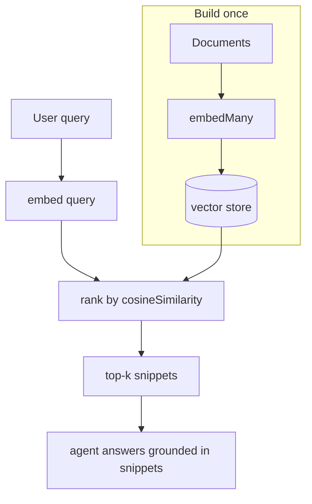

# Lesson 7 — RAG: embeddings + retrieval

> **You'll build:** an agent that answers from *your own* documents by embedding
> them, retrieving the most relevant snippets, and grounding its reply in them.
> **Concepts:** embeddings, `embed` / `embedMany`, `cosineSimilarity`, retrieval-as-a-tool  ·  **Run:** `yarn dev 5`

## The idea

Our agents so far only know what's in the model's training data plus the prompt.
**RAG** ("Retrieval-Augmented Generation") lets an agent answer from documents the
model has never seen: you *retrieve* the most relevant snippets at query time and
feed them in as context.

No vector database needed for this lesson — a tiny in-memory store is enough to
show every moving part.

::: tip Refresher — embeddings
An **embedding** turns text into a vector (a list of numbers) that captures its
*meaning*. Texts with similar meaning get vectors that point the same way. Compare
two vectors with **cosine similarity** (1.0 = identical direction, 0 = unrelated).
:::

## Mental model

RAG is three steps: embed your docs once, embed the query at search time, then
rank docs by similarity and hand the best ones to the model.



The agent only sees the **retrieved** snippets — so its answer is grounded in your
data, not the model's memory.

## The problem

Ask a model about facts it was never trained on and it will often **hallucinate** a
confident, wrong answer:

```ts
// ❌ The model has no idea what the "Zephyr 3000" is — it may invent specs
const { text } = await generateText({ model, prompt: "What's the Zephyr 3000's battery life?" });
```

RAG fixes this by retrieving the real fact first and instructing the model to
answer *only* from retrieved context (and to admit when it doesn't know).

## Walkthrough

### Ranking by cosine similarity

The heart of retrieval is a pure function: score every document against the query
vector, sort descending, take the top-`k`. Because it's pure, it's directly
unit-testable with fixed vectors and no network (see the testing lessons).

<<< @/../src/agents/05-rag.ts#rank{ts}

Things to notice:

- `cosineSimilarity` (from the SDK) does the vector math; we just sort by it.
- `Array.prototype.sort` is stable in modern engines, so equal scores keep input
  order — a property the spec tests pin down.
- Extracting this as a plain exported function is a deliberate testability choice:
  the deterministic core is separated from the network-bound embedding calls.

### Retrieval as a tool

Rather than always stuffing context in, we expose retrieval as a `searchKnowledge`
**tool** the agent calls on demand. Its `description` tells the model to search
before answering.

<<< @/../src/agents/05-rag.ts#search-tool{ts}

The agent decides *when* to search, reads the returned snippets, and grounds its
answer in them. The system prompt instructs it to answer **only** from the tool's
results and to say it doesn't know otherwise — so the out-of-scope question
("price of Acme Corp stock") is correctly declined instead of hallucinated.

::: tip Embed the query with the *same* model
Always embed the query with the **same** embedding model used for the documents
(`openai.embedding("text-embedding-3-small")` here). Mixing models produces vectors
that aren't comparable, and similarity scores become meaningless.
:::

## Run it

```bash
yarn dev 5
```

You'll see the store get built, a raw retrieval (with similarity scores) for a
sample query, then the agent answering three questions — two grounded in the docs
and one (stock price) it correctly refuses because the fact isn't in the knowledge
base.

## Production caveats

::: warning In-memory is a teaching tool, not production
This lesson scans every vector on every query — fine for six documents, hopeless
for six million. Production RAG uses a **vector database** (pgvector, Pinecone,
Qdrant, …) with approximate-nearest-neighbor indexing, plus chunking, metadata
filters, and re-ranking.
:::

::: warning Retrieved text is untrusted input
Documents can contain **prompt-injection** payloads ("ignore your instructions…").
Treat retrieved snippets as untrusted (Lesson 10) — don't let them silently
override your system prompt or trigger sensitive tools.
:::

## Exercises

1. **Tune `k`.** Change the top-`k` from 3 to 1. Does the agent still answer the
   battery+recharge question correctly? Why might a larger `k` help or hurt?

   ::: details Solution
   With `k=1` the agent may miss the recharge fact (it's in a different document
   than battery life), giving a partial answer. Larger `k` adds recall but also
   noise and tokens — there's a precision/recall trade-off to tune.
   :::

2. **Add a document.** Append a new fact to `KNOWLEDGE_BASE` and ask about it. Do
   you need to re-embed? Where does that happen?

   ::: details Solution
   Yes — `buildVectorStore` calls `embedMany` over the whole base, so adding a
   document means re-running that step (or embedding just the new doc and pushing
   it into the store). Retrieval only finds what's been embedded.
   :::

3. **Probe the refusal.** Ask something adjacent but unlisted (e.g. "Is the Zephyr
   waterproof?"). Does it decline? What makes refusal reliable?

   ::: details Solution
   It should decline because the fact isn't retrievable. Reliable refusal comes
   from the **system prompt** instruction to answer only from `searchKnowledge`
   results plus low similarity scores for unlisted facts.
   :::

## Key takeaways

- **RAG** grounds an agent in your documents: embed docs → embed query → rank by
  `cosineSimilarity` → feed the top-`k` to the model.
- Use **`embedMany`** to index documents and **`embed`** for the query — with the
  **same** embedding model.
- Keep the ranking logic a **pure function** so it's unit-testable without network.
- Expose retrieval as a **tool** and instruct the agent to answer only from results
  (and admit when it can't) to prevent hallucination.
- In-memory search is for learning; production needs a real vector DB, and
  retrieved text must be treated as untrusted input.
