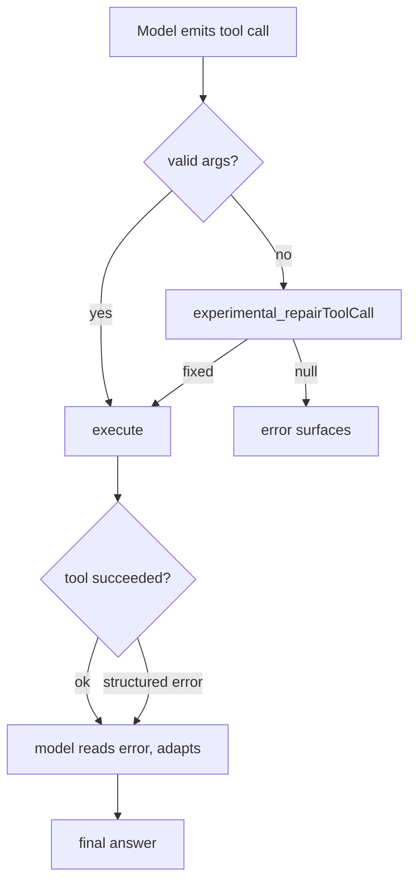

# Lesson 8 — Robust agents

> **You'll build:** an agent that survives tool failures and malformed tool calls
> by recovering *inside the loop* instead of crashing.
> **Concepts:** structured errors vs throwing, `experimental_repairToolCall`, `NoSuchToolError`  ·  **Run:** `yarn dev 6`

## The idea

Everything in Parts I–II assumed the happy path. Real agents must survive two
kinds of failure:

1. **Tools that fail** — bad data, network errors, business-rule violations
   ("insufficient funds").
2. **Malformed tool calls** — the model emits arguments that don't match the
   schema, or invents a tool that doesn't exist.

A robust agent recovers *within* the loop — it reads the problem and adapts —
rather than throwing and killing your program.

## Mental model

Failures become **data** the model can react to, not exceptions that abort the run.



Both a failed tool and a repaired call feed back into the loop — the agent keeps
going.

## The problem

A tool that **throws** on a business-rule violation is blunt:

```ts
// ❌ Throwing for an expected condition is hard for the model to handle well
execute: async ({ amount }) => {
  if (amount > available) throw new Error("insufficient funds");
  // …
}
```

The model can't easily reason about an exception. Far better: **return** a
structured error it can read and recover from.

## Walkthrough

### Return errors, don't throw

The transfer tool reports failure as a structured `{ ok: false, error, message }`
object. The model sees it as a normal tool result and can apologize or retry with
a valid amount.

<<< @/../src/agents/06-robust.ts#structured-error{ts}

Things to notice:

- The happy path returns `{ ok: true, … }`; the failure path returns
  `{ ok: false, error: "INSUFFICIENT_FUNDS", message }`. Same shape family, easy
  for the model to branch on.
- Nothing throws — the agent loop continues and the model crafts a helpful reply.

### Repair malformed tool calls

When the model's arguments fail validation (or it calls a non-existent tool), the
`experimental_repairToolCall` hook runs. Return a corrected call to retry, or
`null` to let the error stand.

<<< @/../src/agents/06-robust.ts#repair{ts}

The hook distinguishes the two error types with `NoSuchToolError.isInstance(error)`
— a hallucinated tool can't be safely fixed (return `null`), but malformed JSON
arguments can often be salvaged by re-extracting the first `{...}` block.

::: tip Wire the hook into the call
Pass it as `experimental_repairToolCall: repairToolCall` on `generateText` /
`streamText`. The repair hook's `error` is `NoSuchToolError | InvalidToolInputError`.
:::

## Run it

```bash
yarn dev 6
```

DEMO 1 asks for a transfer that exceeds the balance — the tool returns a structured
error and the agent explains the problem and suggests a valid amount. DEMO 2 shows a
successful transfer for contrast. Inspect the printed `tool result:` lines to see the
structured error flowing back through the loop.

## Production caveats

::: warning Throwing isn't always wrong
Return structured errors for *expected* business conditions (insufficient funds,
not found). Reserve **throwing** for truly exceptional, unrecoverable states. The
SDK still feeds a thrown error back to the model rather than crashing — but an
explicit `{ ok: false }` is clearer and easier to reason about.
:::

::: tip Keep repairs conservative
A repair hook that "guesses" too aggressively can mask real bugs. Salvage obvious
cases (extract valid JSON) and return `null` otherwise so genuine failures still
surface.
:::

## Exercises

1. **Add a second failure mode.** Give `transferMoney` a check that rejects a
   `toAccount` of `"BLOCKED"`. Return a distinct `error` code. How does the agent
   phrase its reply?

   ::: details Solution
   Add `if (toAccount === "BLOCKED") return { ok: false, error: "ACCOUNT_BLOCKED", … }`.
   The model reads the new code/message and explains that the destination is
   blocked — different wording than the funds error, driven entirely by the data.
   :::

2. **Trigger the repair hook.** Imagine the model sends `input` wrapped in
   markdown fences (```` ```json … ``` ````). Trace how the regex salvages it.

   ::: details Solution
   The `raw.match(/\{[\s\S]*\}/)` grabs the first `{...}` block, ignoring the
   surrounding fences. `JSON.parse` validates it, and `{ ...toolCall, input }` retries
   with the cleaned JSON.
   :::

3. **Fail safe on hallucination.** Why does the hook return `null` for
   `NoSuchToolError` instead of guessing the closest tool name?

   ::: details Solution
   Guessing could call the wrong tool with attacker- or model-controlled intent.
   Returning `null` lets the error surface safely rather than silently doing
   something unintended.
   :::

## Key takeaways

- Prefer **returning structured errors** (`{ ok: false, error, message }`) over
  throwing for expected failures — the model reads them and recovers.
- Use **`experimental_repairToolCall`** to fix malformed tool calls; return a
  corrected call or `null`.
- Distinguish error types with **`NoSuchToolError.isInstance(error)`** — don't try
  to repair a hallucinated tool.
- Robustness means recovering *inside* the loop, not crashing the process.
