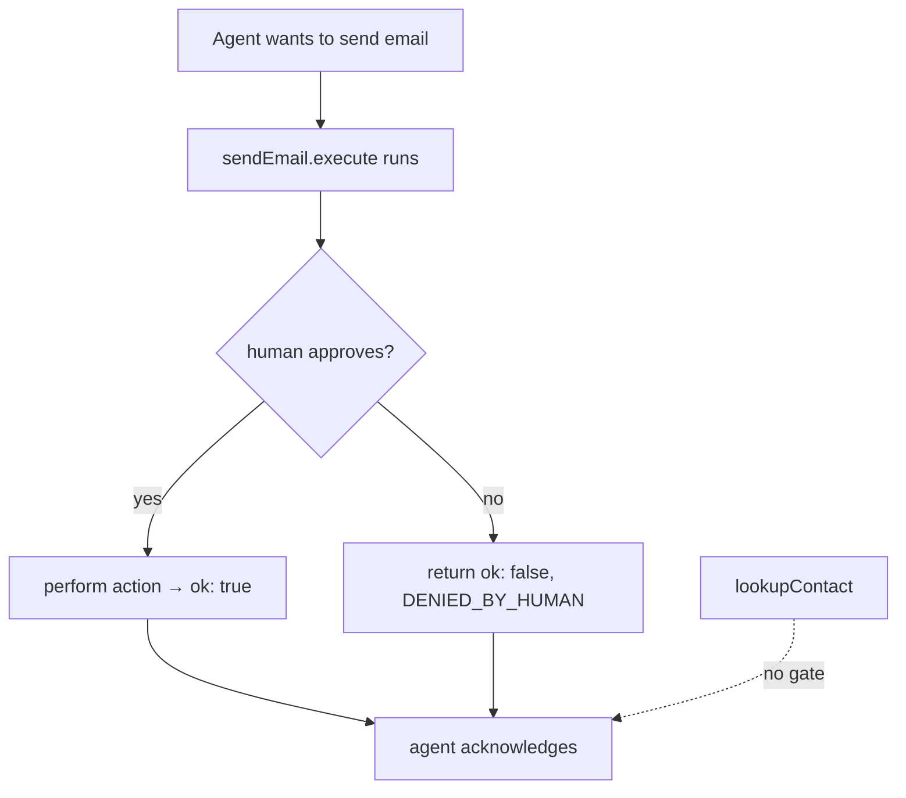

# Lesson 9 — Human-in-the-loop

> **You'll build:** an agent that pauses for human approval before taking
> sensitive actions (sending email), while safe tools run freely.
> **Concepts:** approval gates, fail-safe defaults, structured "denied" results  ·  **Run:** `yarn dev 7`

## The idea

Once an agent can take **real-world actions** — send email, delete data, move
money — you don't want it acting unsupervised. The fix is an **approval gate**: the
agent proposes the action, a human approves or denies, and only then does it run.

The elegant part: the agent loop is *unchanged*. The gate lives **inside the tool's
`execute`**. Safe, read-only tools run without prompting.

## Mental model

The approval check sits inside the sensitive tool; everything else is the normal
loop.



Denial isn't an error — it's a **structured result** the agent reads and accepts
gracefully.

## The problem

Letting an agent send email unsupervised is risky:

```ts
// ❌ Fires immediately — no human in the loop
execute: async ({ to, subject, body }) => { await mailer.send({ to, subject, body }); }
```

A confused or injected agent could email the wrong person. We want a **pause** for
a human decision before anything irreversible happens.

## Walkthrough

### A fail-safe approval prompt

The gate asks a yes/no question in the terminal and **defaults to deny** on empty
or EOF input — so piped input or an accidental Enter never approves an action.

<<< @/../src/agents/07-human-in-the-loop.ts#approval{ts}

Note the `try/catch/finally`: `readline`'s `question()` rejects on EOF, which we
treat as "deny" (fail safe) and always close the interface.

### Gating the sensitive tool

The `sendEmail` tool shows the human exactly what's proposed, then calls
`askApproval`. On denial it returns a structured `{ ok: false, status:
"DENIED_BY_HUMAN" }` — never throwing — so the agent adapts politely.

<<< @/../src/agents/07-human-in-the-loop.ts#sensitive-tool{ts}

Things to notice:

- The human sees the full action (to/subject/body) *before* deciding — informed
  consent, not a blind yes/no.
- Denial returns the same structured-result shape as Lesson 8 — the agent
  acknowledges the refusal instead of crashing or retrying.
- The safe `lookupContact` tool (in the same file) has **no gate** — reading data
  needs no approval.

::: tip There's also a first-class approval API
The SDK ships a built-in flow (`needsApproval` on a tool +
`ToolApprovalRequest` / `addToolApprovalResponse`), geared to the Chat/UI message
stream. For a CLI, the in-`execute` prompt shown here is the simplest approach.
:::

## Run it

```bash
yarn dev 7
```

The agent looks up a contact (no prompt), then proposes an email and **waits for
you**. Type `y` to approve or `n` to deny. Try one of each to see both paths — an
approved send and a gracefully-acknowledged denial.

## Production caveats

::: warning Default to deny
Any ambiguity — empty input, EOF, a timeout — must resolve to **deny**. An approval
gate that defaults to "yes" is worse than no gate, because it creates false
confidence. The lesson's `catch` returning `false` is the critical line.
:::

::: tip Gate by capability, not by tool name
Decide what's "sensitive" by what the action can do (irreversible, costly,
external side effects), not by which tool happens to be involved. Reading is
usually safe; writing/sending/deleting usually needs a human.
:::

## Exercises

1. **Add a second sensitive tool.** Create a `deleteRecord` tool that also gates on
   `askApproval`. Does the loop need any changes?

   ::: details Solution
   No loop changes — just put the `askApproval` call inside `deleteRecord.execute`
   and return a structured denied result. The gate is per-tool; the agent loop is
   agnostic to it.
   :::

2. **Prove the fail-safe.** Pipe empty input (`echo "" | yarn dev 7`). What does the
   approval gate do, and why is that the safe outcome?

   ::: details Solution
   `question()` rejects on EOF, the `catch` returns `false`, and the email is
   denied. Failing closed means automated/piped runs can never approve a sensitive
   action by accident.
   :::

3. **Log the decision.** Add an audit line recording approve/deny with a timestamp.
   Why is this valuable in production?

   ::: details Solution
   An audit trail lets you reconstruct who approved what and when — essential for
   compliance, debugging, and detecting abuse of the agent's capabilities.
   :::

## Key takeaways

- Put an **approval gate inside the sensitive tool's `execute`**; the agent loop
  stays unchanged.
- **Default to deny** on empty/EOF/ambiguous input — fail safe.
- Return a **structured "denied" result** (don't throw) so the agent acknowledges
  the refusal gracefully and doesn't retry.
- Safe, read-only tools run without prompting; gate by capability.
