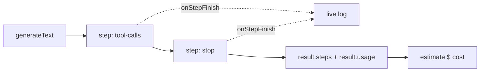

# Lesson 11 — Observability, token usage & cost

> **You'll build:** a traced agent run that reports every step, token counts, and
> an estimated dollar cost.
> **Concepts:** `result.steps`, `result.usage`, `onStepFinish`, `finishReason`, cost estimation  ·  **Run:** `yarn dev 9`

## The idea

Before you ship an agent you must be able to answer three questions:

1. **What did it do?** Which tools, in what order, and why it stopped.
2. **How many tokens did it use?** Per step and in total.
3. **What did that cost?**

The SDK exposes all of this. Tracing isn't an afterthought — it's how you debug,
monitor, and budget an agent in production.

## Mental model

Two views: **live** telemetry as the agent runs (`onStepFinish`), and a
**post-run** trace plus totals (`result.steps`, `result.usage`).



Each step carries its own `usage` and `finishReason`; the run carries the totals.

## The problem

A black-box agent is impossible to operate:

```ts
// ❌ You get an answer but no idea what it did or what it cost
const { text } = await generateText({ model, tools, prompt });
```

When it misbehaves or the bill spikes, you have nothing to inspect. Instrument it.

## Walkthrough

### Live telemetry with `onStepFinish`

The `onStepFinish` callback fires after every step as the agent runs — perfect for
streaming logs or telemetry to your observability stack.

<<< @/../src/agents/09-observability.ts#on-step-finish{ts}

Each invocation gives you that step's `toolCalls` and `usage`, so you can see tool
selection and token spend *as it happens*.

### Post-run trace & cost

After the run, walk `result.steps` for a detailed trace and read `result.usage` for
totals. Cost is your own arithmetic from token counts and the model's price.

```ts
// Per-step trace
for (const step of result.steps) {
  console.log(step.finishReason, step.usage.totalTokens);
}

// Whole-run totals
const { inputTokens, outputTokens, totalTokens } = result.usage;
const cost = (inputTokens / 1e6) * inPrice + (outputTokens / 1e6) * outPrice;
```

Things to notice:

- `finishReason` per step is `"tool-calls"` (loop continues) or `"stop"` (final
  answer) — it tells you *why* the loop iterated.
- `usage` fields are `number | undefined` (the provider may not report them), so
  always guard with `?? 0` / `?? "?"`.
- Cost is **your** calculation: `(inputTokens/1e6)*inPrice + (outputTokens/1e6)*outPrice`.

::: tip Full tracing with telemetry spans
For production-grade tracing (OpenTelemetry spans), pass
`experimental_telemetry: { isEnabled: true }` to wire the run into your APM.
:::

## Run it

```bash
yarn dev 9
```

The agent handles a three-part task (weather in two cities + a multiplication). You'll
see live `step finished` lines, then a step-by-step trace with per-step tokens, and
finally a run summary with total tokens and an estimated cost in dollars.

## Production caveats

::: warning Token counts can be `undefined`
Not every provider reports usage for every step. Guard every token field
(`usage.totalTokens ?? "?"`) or your logging/cost math will produce `NaN`.
:::

::: tip Cost is an estimate, not a bill
Prices change and providers may count tokens slightly differently. Use the estimate
for budgeting and alerting, but reconcile against your provider's actual invoice.
:::

## Exercises

1. **Set a budget alarm.** In `onStepFinish`, accumulate `totalTokens` and warn if a
   single run crosses a threshold. Why is per-run budgeting useful?

   ::: details Solution
   Summing tokens live lets you abort or alert on a runaway loop before it gets
   expensive. Per-run budgets catch pathological cases (e.g. a tool-call loop that
   won't converge) early.
   :::

2. **Count tool calls.** Tally how many times each tool was called across
   `result.steps`. What does an unusually high count suggest?

   ::: details Solution
   Iterate `result.steps[].toolCalls` and tally by `toolName`. A high count may
   indicate the model is retrying because a tool's description or results are
   unclear — a prompt/tool-design smell.
   :::

3. **Compare models.** Run the same task and swap the price constants for a larger
   model. How does the estimated cost change?

   ::: details Solution
   Larger models have higher per-1M prices, so the same token counts yield a higher
   estimate. This is exactly the trade-off (quality vs cost) observability lets you
   measure rather than guess.
   :::

## Key takeaways

- Use **`onStepFinish`** for live telemetry and **`result.steps`** for a post-run
  trace (toolCalls, toolResults, `finishReason`, per-step `usage`).
- Read totals from **`result.usage`** (`inputTokens` / `outputTokens` /
  `totalTokens`) — always guard for `undefined`.
- **`finishReason`** distinguishes `"tool-calls"` (loop continues) from `"stop"`
  (done).
- **Cost is your own calc** from token counts and model price; treat it as an
  estimate.
- For deep tracing, enable `experimental_telemetry`.
