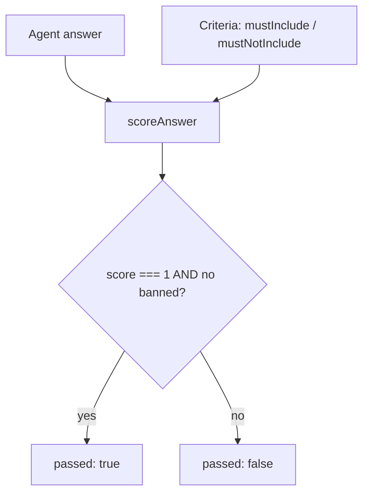

# Lesson 12 — Testing & evaluating agents

> **You'll build:** a deterministic scorer that grades agent answers against
> criteria — the foundation of an eval suite you can run in CI without a network.
> **Concepts:** evals vs snapshots, deterministic scoring, mocking the model, spec-first tests  ·  **Run:** `yarn dev 12`

## The idea

LLM output is **nondeterministic** — the same prompt yields different wording each
run. So you can't snapshot-test an agent's text. Instead you **evaluate** it against
*criteria*: does the answer contain the facts it must, and avoid phrases it
mustn't? That's an **eval**, and a tiny deterministic one runs in CI with no
network.

This lesson also recaps how the whole repo keeps its tests fast and deterministic:
**mock the model**, and pin **pure logic** with unit tests.

## Mental model

Separate the **deterministic core** (testable in CI) from the **nondeterministic
model** (mocked in CI).



The scorer is a pure function — same inputs, same result — so it's trivially
unit-testable.

## The problem

Asserting exact text is doomed:

```ts
// ❌ Flaky — the model rephrases every run
expect(result.text).toBe("Our warranty is 2 years, extendable to 4.");
```

The next run says "We offer a 2-year warranty…" and the test fails despite a correct
answer. Grade by **criteria**, not exact strings.

## Walkthrough

### A deterministic scorer

`scoreAnswer` checks that required substrings are present (case-insensitive) and
banned ones are absent. `score` is the fraction of required substrings found;
`passed` is `score === 1` with no banned phrase.

<<< @/../src/agents/12-evals.ts#score-answer{ts}

Things to notice:

- It's **pure** — no network, no randomness — so it's fast and reliable in CI.
- An empty `mustInclude` trivially scores 1 (nothing required is satisfied).
- This is the seed of a real eval suite: collect representative answers and assert
  they meet criteria, catching regressions in agent quality.

### Mock the model for wiring tests

For agent *plumbing* (does a tool run? does the loop end?), drive `generateText`
with a scripted `MockLanguageModelV3` from `ai/test` — no real LLM, fully
deterministic. The repo's `wiring.spec.test.ts` does exactly this:

```ts
import { MockLanguageModelV3 } from "ai/test";
// step 1: emit a tool-call; step 2: emit final text → assert the loop's behavior
```

This is how CI stays deterministic (no live OpenAI calls) while still testing the
real agent loop.

::: tip Spec-first for deterministic code
The calculator (`safeEvaluate`), the RAG ranker (`rankBySimilarity`), and this
scorer were all written **spec-first**: the tests encode the contract, then the
implementation satisfies them. Pure functions make that easy.
:::

## Run it

```bash
yarn dev 12
```

The demo scores three canned answers: a good warranty answer (passes), an
incomplete one (score < 1, fails), and one containing a banned upsell ("call now",
fails). Then run the real test suite:

```bash
yarn test
```

You'll see the scorer's spec tests, the calculator and RAG-ranker specs, and the
mock-model wiring/security tests — all green, all offline.

## Production caveats

::: warning Substring scoring is a starting point
`mustInclude` / `mustNotInclude` catches gross errors but not nuance ("2 years" vs
"two years"). Real eval suites add normalization, semantic similarity, or
**LLM-as-judge** scoring for harder criteria — but keep a deterministic core for CI.
:::

::: tip Never make CI depend on a live model
Snapshotting real LLM output makes CI flaky and costly. Mock the model for wiring,
unit-test pure logic, and reserve live-model evals for a separate, non-blocking job.
:::

## Exercises

1. **Add a partial-credit case.** Score an answer against `mustInclude: ["2 years",
   "extendable"]` where only one is present. What `score` do you expect?

   ::: details Solution
   `0.5` — one of two required substrings is present, and `passed` is `false`
   because `score !== 1`. Partial credit helps you see *how close* an answer is.
   :::

2. **Write a spec test.** Add a test asserting `scoreAnswer("", { mustInclude: [] })`
   returns `{ score: 1, passed: true }`. Why is this edge case worth pinning?

   ::: details Solution
   It documents the "nothing required" contract so a future refactor can't
   accidentally change it. Edge cases like empty inputs are where regressions love
   to hide.
   :::

3. **Mock a two-tool run.** Using `MockLanguageModelV3`, script a model that calls a
   tool then answers, and assert the tool ran once. What does this verify?

   ::: details Solution
   It verifies the agent *loop wiring* — that a tool's `execute` runs on a tool-call
   step and the loop terminates on the `stop` step — deterministically, exactly like
   ST-21 in `wiring.spec.test.ts`.
   :::

## Key takeaways

- **Evaluate, don't snapshot:** grade nondeterministic answers against
  **criteria** (`mustInclude` / `mustNotInclude`), not exact strings.
- Keep the scorer a **pure, deterministic function** so it runs fast and offline in
  CI.
- **Mock the model** (`MockLanguageModelV3` from `ai/test`) to test agent wiring
  without a network.
- Write deterministic logic **spec-first**; reserve live-model evals for a separate
  job.
- Substring scoring is a starting point — layer in semantic/LLM-judge scoring for
  nuance.
