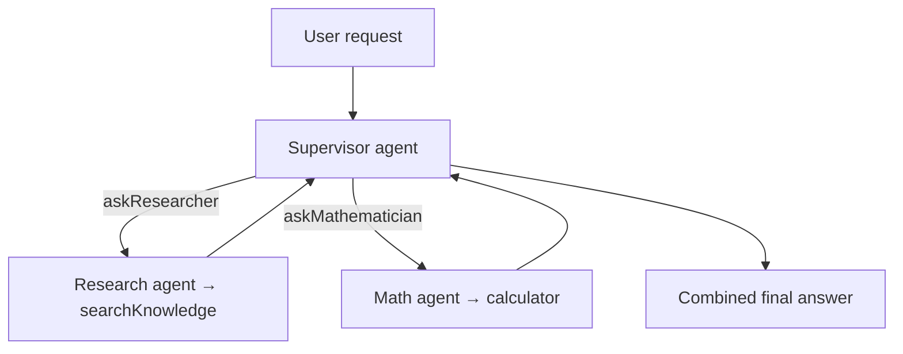

# Lesson 13 — Multi-agent orchestration

> **You'll build:** a supervisor agent that delegates sub-tasks to specialist
> agents — by wrapping each specialist as a tool.
> **Concepts:** supervisor/specialist pattern, agents-as-tools, delegation, routing  ·  **Run:** `yarn dev 8`

## The idea

So far each agent has been a lone worker. Real systems often use a **team**: a
**supervisor** agent that breaks a request into sub-tasks and delegates each to a
focused **specialist** agent, then combines their answers.

The trick that makes this simple: **wrap each specialist agent as a tool.** The
supervisor doesn't know (or care) that a "tool" is itself a whole agent — it just
calls it with a sub-question and gets an answer back. Agents all the way down. 🐢

## Mental model

A supervisor with two specialist-tools, each a `ToolLoopAgent` with its own
instructions and tools.



Each specialist is narrow and reliable; the supervisor only routes and combines.

## The problem

One mega-agent with every tool and a sprawling prompt becomes unreliable — it
mixes concerns and picks the wrong tool. Splitting responsibilities keeps each
agent focused, but now something has to **coordinate** them. That's the
supervisor's job.

## Walkthrough

### A focused specialist

Each specialist is just a `ToolLoopAgent` (Lesson 6) with a narrow persona and a
small tool set — here, a research agent backed by a knowledge-base search.

<<< @/../src/agents/08-multi-agent.ts#specialist{ts}

### Wrap the specialist as a tool

The magic step: expose the specialist's `.generate()` through a `tool()` so the
supervisor can call it like any other tool.

<<< @/../src/agents/08-multi-agent.ts#agent-as-tool{ts}

Inside `execute`, we just run the specialist agent and return its text. From the
supervisor's perspective this is indistinguishable from a normal tool call.

### The supervisor routes and combines

The supervisor's tools *are* the specialists. Its instructions tell it to always
delegate — never to compute or recall facts itself — so routing stays reliable.

<<< @/../src/agents/08-multi-agent.ts#supervisor{ts}

Things to notice:

- The supervisor's `stopWhen` budget is larger (it makes several delegations plus
  a final synthesis step).
- "Never compute/recall yourself — always delegate" is the key instruction; without
  it the supervisor may answer directly and skip the specialists.
- You can inspect `result.steps[].toolCalls` to see exactly which specialist
  handled what.

## Run it

```bash
yarn dev 8
```

The request ("total cost of the company retreat") needs **both** a lookup
(attendees + per-person budget, from the research agent) and a **calculation** (the
total, from the math agent). The output prints the supervisor's delegations and the
combined final answer — proof that two specialists solved a task neither could
alone.

## Production caveats

::: warning Delegation costs tokens (and latency)
Every specialist call is a full agent run — its own tokens and round-trips. A
supervisor that over-delegates gets slow and expensive. Give specialists clear,
non-overlapping roles and keep the team small.
:::

::: tip Narrow specialists are more reliable
The more focused a specialist's instructions and tool set, the more predictable it
is. Prefer several sharp specialists over one vague generalist — and tell the
supervisor to always delegate so routing is deterministic.
:::

## Exercises

1. **Add a third specialist.** Create a `summarizer` agent and wrap it as
   `askSummarizer`. When would the supervisor route to it?

   ::: details Solution
   Define a `ToolLoopAgent` with summarization instructions, wrap its `.generate()`
   in a tool, and add it to the supervisor's tools. The supervisor routes to it when
   the task calls for condensing the other specialists' outputs.
   :::

2. **Trace the routing.** Log `result.steps[].toolCalls` and identify which
   specialist answered which sub-question.

   ::: details Solution
   Each tool call's `toolName` (`askResearcher` / `askMathematician`) and its
   `input.question` show the delegation. The retreat task produces a research call
   for the facts and a math call for the total.
   :::

3. **Force a failure.** Remove the "always delegate" instruction. Does the
   supervisor still use the specialists? What does that tell you?

   ::: details Solution
   It may answer directly (and wrongly, lacking the knowledge base), showing how
   much routing reliability depends on explicit instructions — orchestration is
   prompt engineering as much as architecture.
   :::

## Key takeaways

- A **supervisor** breaks a request into sub-tasks and delegates to focused
  **specialist** agents, then combines results.
- **Wrap each specialist `ToolLoopAgent` as a tool** — the supervisor calls it like
  any other tool.
- Give specialists **narrow** instructions/tools; tell the supervisor to **always
  delegate** for reliable routing.
- Inspect `result.steps[].toolCalls` to see which specialist did what.
- Delegation multiplies tokens and latency — keep the team small and focused.
