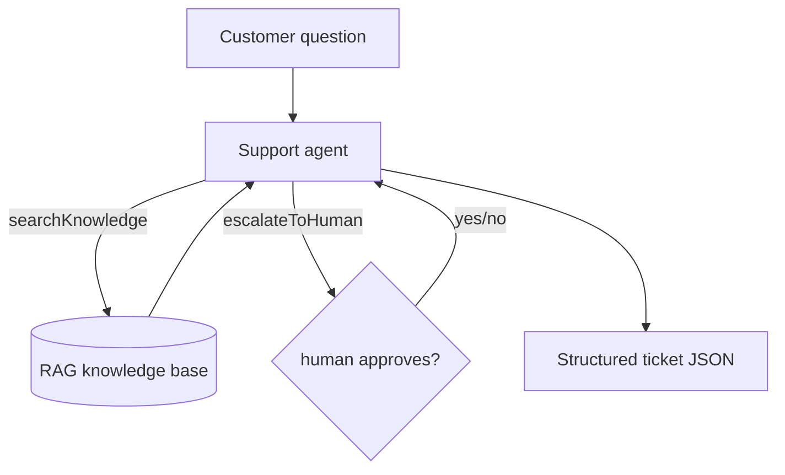

# Lesson 14 — Capstone walkthrough

> **You'll build:** understanding of a realistic support agent that combines
> *every* technique from the course into one cohesive system.
> **Concepts:** RAG + structured output + human approval + robust errors + observability, composed  ·  **Run:** `yarn dev 10`

## The idea

Each earlier lesson taught one technique in isolation. Real agents combine them.
This capstone is an Acme Corp **customer-support assistant** that:

- answers from a knowledge base (**RAG**, Lesson 7),
- returns a validated JSON "ticket" (**structured output**, Lesson 5),
- escalates to a human when it can't resolve an issue (**human-in-the-loop**,
  Lesson 9),
- uses tools that return **structured errors** (Lesson 8),
- and prints a **token/step trace** (observability, Lesson 11).

One agent, five techniques, working together.

## Mental model

A single `ToolLoopAgent` orchestrates two tools and emits a structured ticket.



Everything you learned, composed into one loop with a typed final answer.

## The problem

A toy demo handles only the happy path. A *real* support agent must ground its
answers (no hallucinating warranty terms), refuse to act unsupervised on sensitive
escalations, survive tool failures, and emit data your systems can store. No single
technique covers all of that — you **compose** them.

## Walkthrough

### The sensitive escalation tool

Escalation is gated behind human approval (Lesson 9) and returns a **structured**
result either way (Lesson 8) — never throwing.

<<< @/../src/agents/10-capstone.ts#escalate{ts}

On approval it returns a ticket id; on denial a structured `ESCALATION_DENIED`
the agent reads and adapts to. The RAG `searchKnowledge` tool (also in the file)
likewise wraps retrieval in a `try/catch` and returns `{ ok: false }` on failure.

### The composed agent

A single `ToolLoopAgent` ties it together: RAG + escalation tools, the agent loop,
and a structured `ticketSchema` output.

<<< @/../src/agents/10-capstone.ts#agent{ts}

Things to notice:

- The instructions enforce "**always** search before answering, answer **only** from
  the knowledge base, escalate if it's not covered" — grounding + safe fallback in
  one prompt.
- `output: Output.object({ schema: ticketSchema })` forces a typed ticket
  (`resolved`, `escalated`, `category`, …) as the final answer.
- The same `stopWhen: stepCountIs(8)` loop drives RAG retrieval, optional
  escalation, and final synthesis.

## Run it

```bash
yarn dev 10
```

Two scenarios run: a warranty question (resolved from the knowledge base) and an
upset customer demanding compensation (not covered → the agent proposes escalation
and waits for your `y/n`). Each prints a structured ticket plus an observability
line (steps · tools used · tokens). Approve or deny the escalation to see both
paths.

## Production caveats

::: warning Composition multiplies failure modes
Each technique adds a place things can go wrong — embedding calls, approval EOF,
schema validation. The capstone handles each (structured errors, fail-safe deny,
schema retry), but in production you'd add logging and alerting at every seam.
:::

::: tip This is a template, not a product
The capstone is a faithful *shape* for a real agent, but a production system needs a
real vector DB, auth, persistence for tickets, rate limits, and evals (Lesson 12)
gating deploys. Treat it as the skeleton to flesh out.
:::

## Exercises

1. **Add a category.** Extend `ticketSchema`'s `category` enum with `"shipping"` and
   add a matching knowledge-base fact. Does the agent classify correctly?

   ::: details Solution
   Add `"shipping"` to the enum and a shipping fact to `KNOWLEDGE_BASE`. The agent
   retrieves the new fact and sets `category: "shipping"` in the ticket — structured
   output plus RAG working together.
   :::

2. **Force escalation.** Ask something clearly outside the knowledge base. Does the
   agent escalate, and what does the denied path return?

   ::: details Solution
   It calls `escalateToHuman`; if you deny, the tool returns `ESCALATION_DENIED` and
   the agent acknowledges it can't resolve the issue — the structured-denial pattern
   from Lesson 9.
   :::

3. **Inspect the trace.** Read the observability line. Which tools ran for the
   resolved vs the escalated scenario?

   ::: details Solution
   The resolved case shows `[searchKnowledge]`; the escalation case shows
   `[searchKnowledge, escalateToHuman]`. The trace makes the agent's decision path
   auditable.
   :::

## Key takeaways

- Real agents **compose** techniques: RAG + structured output + human approval +
  robust errors + observability in one loop.
- Ground answers (RAG), force a typed final answer (`Output.object`), gate sensitive
  actions (approval), and return structured errors so the agent adapts.
- A single `ToolLoopAgent` with the right tools and instructions can express a
  realistic production workflow.
- The capstone is a **template** — production needs a real vector DB, persistence,
  auth, and eval-gated deploys.
