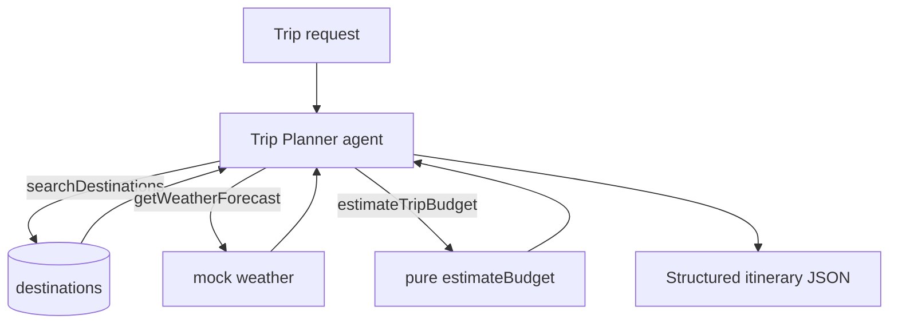

# Lesson 15 — Build your own agent

> **You'll build:** a brand-new **Trip Planner** agent from scratch, re-applying
> every technique in a fresh domain — guided by checkpoints.
> **Concepts:** tools, pure/safe logic, the agent loop, structured output — applied end-to-end  ·  **Run:** `yarn dev 13`

## The idea

You've learned the parts; now assemble them yourself in a **new domain**. We'll
build a Trip Planner that picks a destination, checks the weather, and estimates a
budget — returning a structured itinerary. Same toolkit, different problem.

There are two files:

- **`13-byo-starter.ts`** — a scaffold with `// TODO:` checkpoints. Your canvas.
- **`13-byo-solution.ts`** — the complete reference. Peek only after trying.

::: tip Work the checkpoints in order
Each checkpoint maps to a concept you already know: tools (Part I), safe logic
(Lesson 3/10), the reusable agent (Lesson 6), and structured output (Lesson 5).
:::

## Mental model

The same anatomy as every agent you've built — just a new set of tools and a new
output schema.



## The starter

The scaffold compiles and runs but its stubs throw `TODO` — your job is to fill
them in. It typechecks under strict settings so `yarn build` stays green while you
work.

```ts
// 13-byo-starter.ts — Checkpoint 1: a PURE budget function
export function estimateBudget(dailyCost: number, nights: number, flightCost: number): number {
  // TODO: validate non-negative inputs, then return the rounded total.
  throw new Error("TODO: implement estimateBudget");
}
```

Each checkpoint builds on the last until you have a working agent.

## Walkthrough (the solution)

### Checkpoint 1 — safe, pure logic

Keep risky math in a **pure, testable** function — the same principle as
`safeEvaluate` (Lesson 3/10). No `eval`, no network, so it's trivially unit-tested.

<<< @/../src/agents/13-byo-solution.ts#estimate-budget{ts}

### Checkpoints 2 — the tools

Three tools, each with a tight Zod schema. The budget tool **wraps** the pure
function and returns a structured result (Lesson 8) rather than throwing.

<<< @/../src/agents/13-byo-solution.ts#tools{ts}

### Checkpoints 3 & 4 — schema + the reusable agent

Describe the itinerary you want as a schema, then configure one `ToolLoopAgent` with
the tools, the loop budget, and the structured output baked in.

<<< @/../src/agents/13-byo-solution.ts#itinerary-schema{ts}

<<< @/../src/agents/13-byo-solution.ts#agent{ts}

Things to notice:

- The instructions tell the agent to use `estimateTripBudget` for **all** budget
  math — never to compute it itself. Deterministic tools beat the model's mental
  arithmetic.
- `Output.object({ schema: itinerarySchema })` guarantees a typed itinerary as the
  final answer.
- It's the *exact same shape* as every other agent in the course — tools + loop +
  structured output.

## Run it

```bash
yarn dev 13
```

This runs the **solution**. You'll see the agent call all three tools and return a
clean itinerary — e.g. Lisbon, 4 nights, €510 (= 90×4 + 150, exactly what
`estimateBudget` computes). Then open `13-byo-starter.ts` and build your own.

## Production caveats

::: warning Keep the deterministic core testable
The budget function is pure on purpose — it's covered by unit tests (ST-27…29) with
no network. When you add features, keep risky logic in pure functions so CI can pin
it down, exactly as the rest of the course does.
:::

::: tip The starter must always typecheck
The scaffold uses valid stub bodies (`throw new Error("TODO")` / placeholder
returns) so `yarn build` and the smoke-run stay green while it's incomplete. When
you build your own, preserve that — broken types block the whole project.
:::

## Exercises

1. **Implement Checkpoint 1.** Fill in `estimateBudget` in the starter and run the
   ST-27 test pattern against it. Does it match the solution?

   ::: details Solution
   `if (nights < 0 || dailyCost < 0 || flightCost < 0) throw …; return
   Math.round(dailyCost * nights + flightCost);` — identical to the solution, and it
   satisfies the rounding + non-negative tests.
   :::

2. **Add a tool.** Implement `searchDestinations` in the starter so the agent can
   pick a city by vibe. What's the minimal schema?

   ::: details Solution
   `inputSchema: z.object({ query: z.string() })`, and `execute` filters a small
   destinations array by keyword — mirroring the solution. One field is enough for
   the model to drive it.
   :::

3. **Pick your own domain.** Sketch the tools and output schema for a *different*
   agent (e.g. a recipe planner). Which course techniques apply?

   ::: details Solution
   You'd define domain tools (search ingredients, compute nutrition), keep any math
   in a pure function, configure a `ToolLoopAgent`, and shape output with
   `Output.object`. Every technique transfers — only the domain changes.
   :::

## Key takeaways

- You can build an agent if you can: define **tools** with tight schemas, keep risky
  logic in a **pure** function, configure a **reusable agent** with the loop, and
  shape the answer with **structured output**.
- The Trip Planner is a *new domain* built from the *same parts* — the skills
  transfer directly.
- Start from the **starter** (it typechecks despite TODOs); check your work against
  the **solution**.
- Keep deterministic logic pure so it stays unit-testable in CI.
