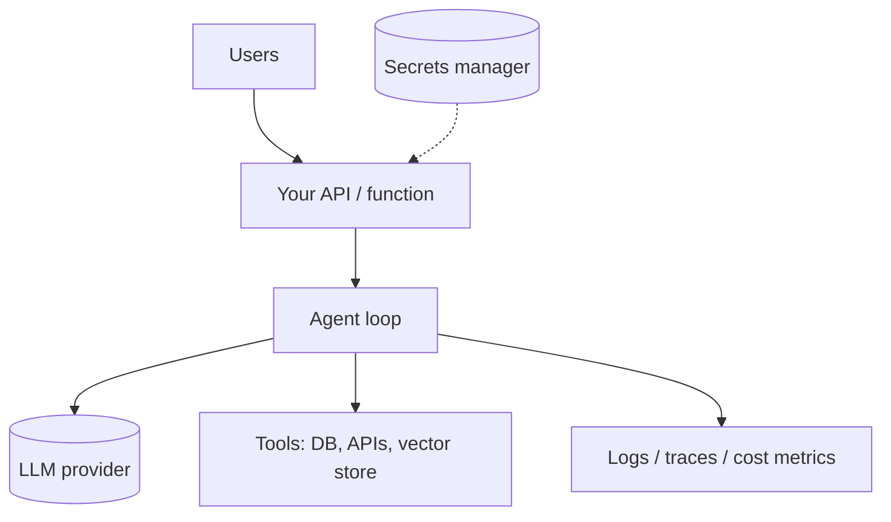

# Lesson 16 — Deploying & running agents in production

> **You'll build:** a mental checklist for taking *your own* agent from a local
> script to a reliable production service.
> **Concepts:** runtime models, secrets, rate limits, observability, evals as a gate  ·  **Run:** *(prose lesson — no runnable file)*

::: warning This lesson is about deploying YOUR agent — not these docs
This course's documentation site ships to GitHub Pages via its own CI workflow.
That pipeline is **not** what this lesson covers. Here we mean deploying the
**agent you build** — a program that calls an LLM, runs tools, and serves users.
Don't conflate "deploy the docs" with "deploy my agent"; they're unrelated.
:::

## The idea

Everything so far ran as `yarn dev <n>` on your laptop with a `.env` file. Production
is different: many users, untrusted input, real secrets, real costs, and no human
watching the terminal. This lesson is the bridge — what changes when an agent leaves
your machine.

## Mental model

An agent in production is a normal backend service with a few agent-specific
concerns layered on.

The agent loop is the same code you wrote — what's new is everything *around* it.

## Choosing a runtime

| Runtime | Good for | Watch out for |
| ------- | -------- | ------------- |
| **Serverless function** (Lambda, Cloud Functions) | bursty, request/response agents | execution time limits, cold starts vs streaming |
| **Long-running server** (container, VM) | streaming chat, websockets, background work | you manage scaling & uptime |
| **Queue worker** | slow multi-step agents, batch jobs | needs a job store + retries |

A one-shot agent (Lesson 2) fits a serverless function; a streaming chat agent
(Lesson 4) usually wants a long-running process.

## The production checklist

### Secrets & configuration

- **Never commit secrets.** `OPENAI_API_KEY` lives in a secrets manager (or platform
  env vars), never in code or the repo. Locally it's `.env` (git-ignored).
- Make keys **rotatable** and scope them to least privilege.

### Cost & rate limits

- The provider enforces rate limits; handle `429`/`5xx` with **retries and backoff**.
- Cap each run with `stopWhen: stepCountIs(N)` so a misbehaving loop can't burn
  unbounded tokens.
- Track token usage and **cost per request** (Lesson 11) and alert on spikes.

### Reliability

- Tools that hit the network must **return structured errors** (Lesson 8) and have
  their own timeouts/retries.
- Set sensible **timeouts** on the whole agent run — users won't wait forever.
- Make tool actions **idempotent** where possible (safe to retry).

### Safety

- Treat all user and retrieved text as **untrusted** (Lesson 10): quarantine it,
  keep instructions in `system`, and sandbox risky tools.
- Gate sensitive actions behind **human approval** or stricter authz (Lesson 9).
- Apply **least privilege** to every tool's real-world capability.

### Observability

- Emit **structured logs** and **traces** for each run (`experimental_telemetry`,
  Lesson 11) into your APM.
- Record which tools ran, `finishReason`, token usage, and latency per step.

### Quality gates

- Run the **deterministic eval suite** (Lesson 12) in CI; block deploys on
  regressions.
- Keep live-model evals in a **separate, non-blocking** job so CI stays
  deterministic and cheap.

## Production caveats

::: warning Statelessness vs memory
Serverless functions are stateless — conversation memory (Lesson 4) must live in a
**database or cache** keyed by session, not an in-process array. Re-load a bounded
window of history per request and trim/summarize to fit the context window.
:::

::: tip Start boring
Ship the simplest thing that works — a single function calling your agent — then add
streaming, queues, and autoscaling only when traffic demands it. Premature
infrastructure is its own failure mode.
:::

## Exercises

1. **Pick a runtime.** For a customer-support chat agent that streams replies, which
   runtime fits and why?

   ::: details Solution
   A long-running server (container) — streaming needs a persistent connection that
   short-lived serverless functions handle poorly. A queue worker suits slow batch
   jobs, not interactive chat.
   :::

2. **Externalize memory.** Sketch how you'd store conversation history for a
   serverless agent across requests.

   ::: details Solution
   Persist the `ModelMessage[]` in a database/cache keyed by a session id; on each
   request load a recent window, append the new turn, and trim/summarize older turns
   to respect the context window and cost.
   :::

3. **Gate a deploy.** What must pass in CI before your agent ships, per this course?

   ::: details Solution
   The deterministic test/eval suite (`yarn test`) must be green — unit tests for
   pure logic and mock-model wiring tests. Live-model evals run separately and
   non-blocking so CI stays deterministic.
   :::

## Key takeaways

- Deploying **your agent** ≠ deploying these docs — this lesson is about the former.
- Choose a runtime to match the workload: serverless for request/response,
  long-running for streaming, queue workers for slow/batch.
- Production essentials: **secrets** management, **rate-limit/backoff**, run
  **caps** (`stopWhen`), structured-error tools, **timeouts**, and idempotency.
- Treat all external text as **untrusted**, gate sensitive actions, and apply least
  privilege.
- Add **observability** (logs/traces/cost) and gate deploys on a **deterministic
  eval suite**.
- Serverless is **stateless** — externalize conversation memory.
