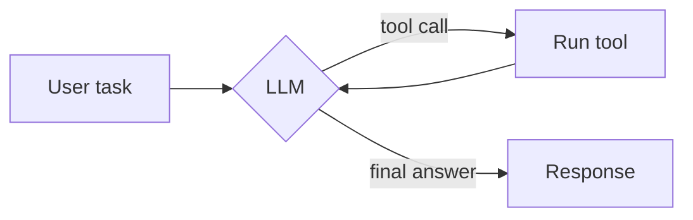

# Deployment & Pages: Agent Masterclass Docs

> **Document**: 06-deployment-pages.md
> **Parent**: [Index](00-index.md)

## Overview

Defines git configuration, the GitHub Actions workflow that builds VitePress and deploys to GitHub Pages, the one-time manual GitHub UI configuration, and the landing page deliverable. *(AR #14, #15, #19, #20, #21, #22)*

## Git Configuration (AR #19, #21)

Current state: no remote; branch `master`.

Required:
- Add remote `origin = git@github.com:blendsdk/building-agents-vercel-ai-sdk.git`.
- Set the default branch to `main`; push and set upstream.

> ⚠️ **`master` is unborn (0 commits) — PF-005.** `git branch -m master main` can fail on a branch with no commits. Use `git checkout -b main` (or `git symbolic-ref HEAD refs/heads/main`) **before** the first commit, so the initial commit lands directly on `main`. No rename needed.
>
> ⚠️ Per `git-commands.md`, all git operations during execution use the `gitcm`/`gitcmp` protocol — no raw `-m` commits in plan execution. The remote-add and branch setup are one-time setup commands (not commits) and are run via `execute_command`.

## GitHub Actions Workflow (AR #15)

File: `.github/workflows/deploy.yml`

```yaml
name: Deploy Docs to GitHub Pages

on:
  push:
    branches: [main]            # AR #19
  workflow_dispatch:

permissions:
  contents: read
  pages: write
  id-token: write

concurrency:
  group: pages
  cancel-in-progress: false

jobs:
  test:
    runs-on: ubuntu-latest
    steps:
      - uses: actions/checkout@v4
      - uses: actions/setup-node@v4
        with: { node-version: 20, cache: yarn }
      - run: yarn install --frozen-lockfile
      - run: yarn test --passWithNoTests   # deterministic, no network (AR #13); passWithNoTests keeps CI green before Phase 1 lands (PF-001)

  build:
    needs: test
    runs-on: ubuntu-latest
    steps:
      - uses: actions/checkout@v4
      - uses: actions/setup-node@v4
        with: { node-version: 20, cache: yarn }
      - run: yarn install --frozen-lockfile
      - run: yarn docs:build
      - uses: actions/configure-pages@v5
      - uses: actions/upload-pages-artifact@v3
        with: { path: docs/.vitepress/dist }

  deploy:
    needs: build
    runs-on: ubuntu-latest
    environment:
      name: github-pages
      url: ${{ steps.deployment.outputs.page_url }}
    steps:
      - id: deployment
        uses: actions/deploy-pages@v4
```

Notes:
- Uses the **official Pages actions** → requires Pages "Source = GitHub Actions" (see manual steps).
- `test` job gates `build` so broken code never ships.
- Node 20 LTS on CI (local dev may differ; lessons run via `tsx`).

## Manual GitHub Configuration (`docs/DEPLOYMENT.md`)

A checklist committed to the repo:

1. Create repo **`building-agents-vercel-ai-sdk`** under org **blendsdk** (public).
2. Push `main` (workflow runs automatically on push).
3. **Settings → Pages → Build and deployment → Source: "GitHub Actions"**.
4. **Settings → Actions → General → Workflow permissions:** allow read/write if prompted (workflow declares scoped `pages: write`, `id-token: write`).
5. Wait for the "Deploy Docs to GitHub Pages" workflow to finish.
6. Visit `https://blendsdk.github.io/building-agents-vercel-ai-sdk/`.

## Landing Page (AR #20)

Deliverable: `docs/index.md` with `layout: home` (hero + feature cards per doc 03), followed by:
- "What you'll build" section.
- 4-part curriculum overview with links.
- "Who this is for" + prerequisites.
- Agent-loop **Mermaid** teaser:



- Footer note: built **with** the Vercel AI SDK (not an official Vercel project); MIT license.

## `.gitignore` additions

> Note (PF-004): `dist/` and `coverage/` are **already** ignored by the existing `.gitignore`. Only the two VitePress paths below need to be added.

- `docs/.vitepress/dist`
- `docs/.vitepress/cache`

## Error Handling

| Error Case | Handling Strategy | AR Ref |
| ---------- | ----------------- | ------ |
| Pages 404 / broken assets | Confirm `base` = `/building-agents-vercel-ai-sdk/` and `.nojekyll` present | AR #14, #22 |
| Workflow can't deploy Pages | Set Source = "GitHub Actions"; verify permissions | AR #15 |
| Push rejected (no remote) | Add remote + create `main` (`git checkout -b main`) before first commit | AR #21, #19 |
| Test job fails | Fix tests before deploy (gate) | AR #13 |

## Testing Requirements
- Workflow YAML validated (lints / runs on first push).
- `yarn docs:build` succeeds locally before relying on CI.
- `yarn test` green in the `test` job.
